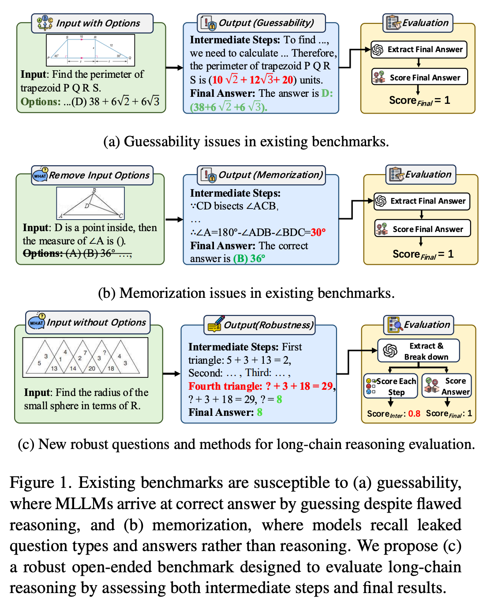
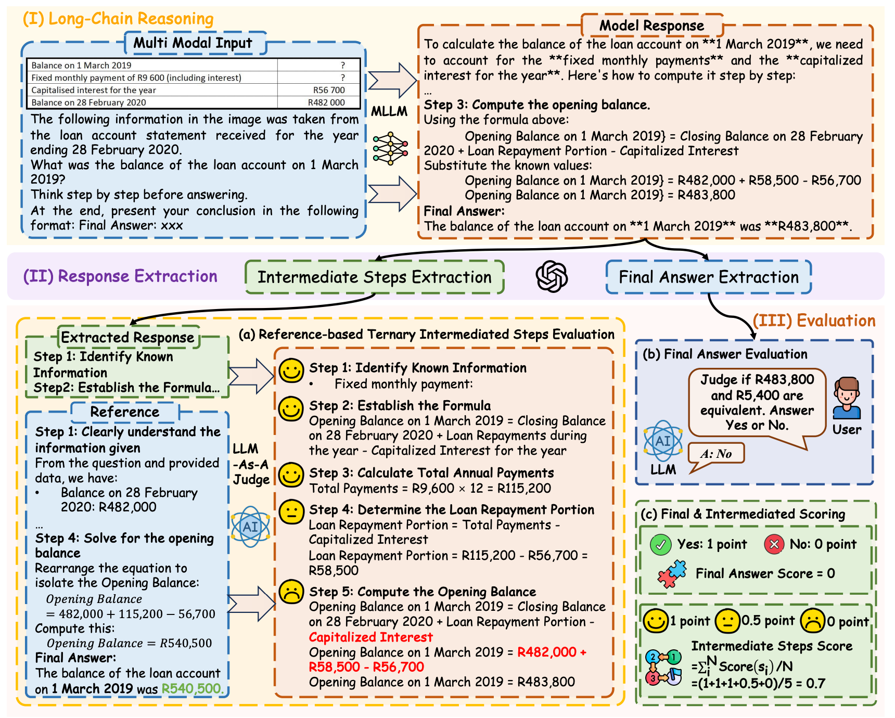

<div align="center">

<h1> MMReason: An Open-Ended Multi-Modal Multi-Step Reasoning Benchmark for MLLMs Toward AGI </h1>


<h5 align="center"> If you find this project useful, please give us a star🌟.

<h5 align="center"> 

<a href='https://arxiv.org/abs/2506.23563'></a>
<a href='https://huggingface.co/datasets/HuanjinYao/MMReason'>
<!--
<a href='https://huggingface.co/HuanjinYao/Mulberry_llava_8b'>
<a href='https://huggingface.co/datasets/HuanjinYao/Mulberry-SFT'>
-->
<!--<a href='https://huggingface.co/collections/HuanjinYao/denseconnector-66500e173fc8c9f05dc98dea'></a>
[](https://zhuanlan.zhihu.com/p/700000183)
<a href='https://huggingface.co/spaces/HuanjinYao/DenseConnector-v1.5-8B'></a>-->

<!--
[Huanjin Yao](https://scholar.google.com/citations?user=pDtsCBQAAAAJ&hl=zh-CN)<sup>2,3*</sup>,
[Qixiang Yin](https://jxhuang0508.github.io/)<sup>4*</sup>,
[Jingyi Zhang]()<sup>1</sup>,
[Min Yang]()<sup>2</sup>,
[Yibo Wang]()<sup>3</sup>,
[Wenhao Wu]()<sup>5</sup>,

[Fei Su]()<sup>4</sup>,
[Li Shen]()<sup>1</sup>,
[Minghui Qiu]()<sup>2</sup>,
[Dacheng Tao]()<sup>1</sup>
[Jiaxing Huang](https://jxhuang0508.github.io)<sup>1✉️</sup>


<sup>1</sup>[Nanyang Technological University](https://www.ntu.edu.sg/), <sup>2</sup>[ByteDance](), <sup>3</sup>[Tsinghua University](https://www.tsinghua.edu.cn/en/), <sup>4</sup>[BUPT](), <sup>5</sup>[USYD](https://www.sysu.edu.cn/sysuen/)

<sup>*</sup>Equal Contribution,       <sup>✉️</sup>Corresponding Author

-->

</h5>
</div>


## 🎙️ News
- [x] **`July 16, 2025`** We have released the MMReason [testmini set](https://huggingface.co/datasets/HuanjinYao/MMReason)!
- [x] **`July 9, 2025`** MMReason has been accepted by **ICCV 2025**!
- [x] **`July 1, 2025`** We release our paper in [arxiv](https://arxiv.org/abs/2506.23563).

## 🌟 About MMReason

MMReason is a new open-ended, multi-modal, multi-step reasoning benchmark designed to precisely and comprehensively evaluate the long-chain reasoning capabilities of MLLMs. Existing benchmarks often fall short due to limited question diversity, vulnerability to guessability and memorization, and insufficient evaluation of intermediate reasoning steps.

<div align=center>

</div>

MMReason addresses these gaps by curating diverse and challenging questions across six disciplines (Math, Business, Science, Engineering, Social Science, Health) and multiple difficulty levels, reformulating them into open-ended formats, and filtering out shortcut cases via a multi-model voting system. Additionally, a reference-based ternary scoring mechanism is used to assess intermediate reasoning steps as shown in below.
<div align=center>

</div>


## 📖 Dataset

### Dataset Source
The **MMReason** benchmark comprises foundational and competition-level questions spanning six disciplines, sourced from the Internet and six established datasets: MMMU, MMMU_Pro, MMStar, M3CoT, MathVerse, and MathVision.

### Data Downloading

All the data examples were divided into two subsets: *testmini* and *test*.

- **testmini**: 1,000 examples used for model development, validation, or for those with limited computing resources.
- **test**: 3,275 examples for standard evaluation. Notably, the answer labels for test will NOT be publicly released.

You can download this dataset by the following command (make sure that you have installed [Huggingface Datasets](https://huggingface.co/docs/datasets/quickstart)):

```python
from datasets import load_dataset

dataset = load_dataset("HuanjinYao/MMReason")
```

Here are some examples of how to access the downloaded dataset:

```python
# print the first example on the testmini set
print(dataset["testmini"][0])
print(dataset["testmini"][0]['idx']) # print the problem id 
print(dataset["testmini"][0]['cot_question']) # print chain-of-thought question text (default input)
print(dataset["testmini"][0]['image']) # print the image path
print(dataset["testmini"][0]['answer']) # print the answer
print(dataset["testmini"][0]['question']) # print original question text
print(dataset["testmini"][0]['discipline']) # print the discipline of the problem

```


<!--
## 🏆 Leaderboard
### Leaderboard on the testmini subset
Accuracy scores on the **testmini** subset (1,000 examples):

| **#** | **Model**                            | **Method** | **Source**                                                   | **Date**   | **ALL**  | **FQA** | **GPS** | **MWP** | **TQA** | **VQA** | **ALG** | **ARI** | **GEO** | **LOG** | **NUM** | **SCI** | **STA** |
| ----- | ------------------------------------ | ---------- | ------------------------------------------------------------ | ---------- | -------- | ------- | ------- | ------- | ------- | ------- | ------- | ------- | ------- | ------- | ------- | ------- | ------- |
| -     | **Human Performance\***              | -          | [Link](https://arxiv.org/abs/2310.02255)                     | 2023-10-03 | **60.3** | 59.7    | 48.4    | 73.0    | 63.2    | 55.9    | 50.9    | 59.2    | 51.4    | 40.7    | 53.8    | 64.9    | 63.9    |
| 1     | **OpenAI o1 🥇**                      | LMM 🖼️      | [Link](https://openai.com/index/learning-to-reason-with-llms/) | 2024-09-12 | **73.9** | -       | -       | -       | -       | -       | -       | -       | -       | -       | -       | -       | -       |
| 2     | **Grok-2 🥈**                         | LMM 🖼️      | [Link](https://x.ai/blog/grok-2)                             | 2024-08-13 | **69.0** | -       | -       | -       | -       | -       | -       | -       | -       | -       | -       | -       | -       |
| 3     | **Grok-2 mini 🥉**                    | LMM 🖼️      | [Link](https://x.ai/blog/grok-2)                             | 2024-08-13 | **68.1** | -       | -       | -       | -       | -       | -       | -       | -       | -       | -       | -       | -       |
| 4     | **Claude 3.5 Sonnet**                | LMM 🖼️      | [Link](https://www.anthropic.com/news/claude-3-5-sonnet)     | 2024-06-20 | **67.7** | -       | -       | -       | -       | -       | -       | -       | -       | -       | -       | -       | -       |
| 5     | **LLaVA-OneVision**                  | LMM 🖼️      | [Link](https://llava-vl.github.io/blog/2024-08-05-llava-onevision/) | 2024-08-06 | **67.5** | -       | -       | -       | -       | -       | -       | -       | -       | -       | -       | -       | -       |
| 6     | **InternVL2-Pro**                    | LMM 🖼️      | [Link](https://github.com/OpenGVLab/InternVL)                | 2024-09-04 | **66.8** | 70.6    | 65.4    | 76.9    | 71.5    | 48.0    | 66.5    | 62.3    | 63.6    | 27.0    | 40.3    | 65.6    | 81.1    |
| 7     | **TextGrad (GPT-4o)**                | LMM 🖼️      | [Link](https://github.com/zou-group/textgrad)                | 2024-07-08 | **66.1** | -       | -       | -       | -       | -       | -       | -       | -       | -       | -       | -       | -       |
| 8     | **Gemini 1.5 Pro (May 2024)**        | LMM 🖼️      | [Link](https://storage.googleapis.com/deepmind-media/gemini/gemini_v1_5_report.pdf) | 2024-05-17 | **63.9** | -       | -       | -       | -       | -       | -       | -       | -       | -       | -       | -       | -       |
| 9     | **GPT-4o**                           | LMM 🖼️      | [Link](https://openai.com/index/hello-gpt-4o/)               | 2024-05-13 | **63.8** | -       | -       | -       | -       | -       | -       | -       | -       | -       | -       | -       | -       |
| 10    | **InternVL-Chat-V1.2-Plus**          | LMM 🖼️      | [Link](https://arxiv.org/abs/2312.14238)                     | 2024-02-22 | **59.9** | 51.7    | 61.1    | 79.6    | 52.5    | 57.0    | 54.5    | 63.2    | 61.1    | 16.2    | 48.6    | 55.7    | 60.8    |
| 11    | **Gemini 1.5 Flash (May 2024)**      | LMM 🖼️      | [Link](https://storage.googleapis.com/deepmind-media/gemini/gemini_v1_5_report.pdf) | 2024-05-17 | **58.4** | -       | -       | -       | -       | -       | -       | -       | -       | -       | -       | -       | -       |
| 12    | **GPT-4T 2024-04-09**                | LMM 🖼️      | [Link](https://openai.com/index/hello-gpt-4o/)               | 2024-05-13 | **58.1** | -       | -       | -       | -       | -       | -       | -       | -       | -       | -       | -       | -       |
| 13    | **Pixtral 12B**                      | LMM 🖼️      | [Link](https://x.com/_philschmid/status/1833954941624615151) | 2024-09-11 | **58.0** | -       | -       | -       | -       | -       | -       | -       | -       | -       | -       | -       | -       |
| 14    | **InternLM-XComposer2-VL-7B**        | LMM 🖼️      | [Link](https://github.com/InternLM/InternLM-XComposer)       | 2024-01-22 | **57.6** | 55.0    | 63.0    | 73.7    | 56.3    | 39.7    | 56.6    | 52.4    | 62.3    | 8.1     | 42.4    | 59.0    | 64.1    |
| 15    | **Gemini 1.0 Ultra**                 | LMM 🖼️      | [Link](https://arxiv.org/abs/2312.11805)                     | 2023-12-06 | **53.0** | 49.1    | 56.2    | 53.8    | 69.0    | 40.2    | 58.4    | 45.9    | 55.6    | 21.6    | 38.9    | 62.3    | 59.5    |
| 16    | **Grok-1.5V**                        | LMM 🖼️      | [Link](https://x.ai/blog/grok-1.5v)                          | 2024-04-12 | **52.8** | -       | -       | -       | -       | -       | -       | -       | -       | -       | -       | -       | -       |
| 17    | **Gemini 1.5 Pro (Feb 2024)**        | LMM 🖼️      | [Link](https://storage.googleapis.com/deepmind-media/gemini/gemini_v1_5_report.pdf) | 2024-02-15 | **52.1** | -       | -       | -       | -       | -       | -       | -       | -       | -       | -       | -       | -       |
| 18    | **Claude 3 Opus**                    | LMM 🖼️      | [Link](https://www-cdn.anthropic.com/de8ba9b01c9ab7cbabf5c33b80b7bbc618857627/Model_Card_Claude_3.pdf) | 2024-03-04 | **50.5** | -       | -       | -       | -       | -       | -       | -       | -       | -       | -       | -       | -       |
| 19    | **GPT-4V (Playground)**              | LMM 🖼️      | [Link](https://arxiv.org/abs/2310.02255)                     | 2023-10-15 | **49.9** | 43.1    | 50.5    | 57.5    | 65.2    | 38.0    | 53.0    | 49.0    | 51.0    | 21.6    | 20.1    | 63.1    | 55.8    |
| 20    | **Claude 3 Sonnet**                  | LMM 🖼️      | [Link](https://www-cdn.anthropic.com/de8ba9b01c9ab7cbabf5c33b80b7bbc618857627/Model_Card_Claude_3.pdf) | 2024-03-04 | **47.9** | -       | -       | -       | -       | -       | -       | -       | -       | -       | -       | -       | -       |
| 21    | **InternVL-Chat-V1.2**               | LMM 🖼️      | [Link](https://arxiv.org/abs/2312.14238)                     | 2024-02-22 | **47.7** | 50.9    | 61.1    | 30.6    | 48.1    | 44.7    | 52.3    | 36.5    | 58.2    | 18.9    | 30.6    | 54.9    | 51.8    |
| 22    | **Math-LLaVA-13B**                   | LMM 🖼️      | [Link](http://arxiv.org/abs/2406.17294)                      | 2024-06-25 | **46.6** | 37.2    | 57.7    | 56.5    | 51.3    | 33.5    | 53.0    | 40.2    | 56.5    | 16.2    | 33.3    | 49.2    | 43.9    |
| 23    | **LLaVA-NeXT-34B**                   | LMM 🖼️      | [Link](https://llava-vl.github.io/blog/2024-01-30-llava-1-6/) | 2024-01-30 | **46.5** | -       | -       | -       | -       | -       | -       | -       | -       | -       | -       | -       | -       |
| 24    | **Claude 3 Haiku**                   | LMM 🖼️      | [Link](https://www-cdn.anthropic.com/de8ba9b01c9ab7cbabf5c33b80b7bbc618857627/Model_Card_Claude_3.pdf) | 2024-03-04 | **46.4** | -       | -       | -       | -       | -       | -       | -       | -       | -       | -       | -       | -       |
| 25    | **Gemini 1.0 Pro**                   | LMM 🖼️      | [Link](https://arxiv.org/abs/2312.11805)                     | 2023-12-06 | **45.2** | 47.6    | 40.4    | 39.2    | 61.4    | 39.1    | 45.2    | 38.8    | 41.0    | 10.8    | 32.6    | 54.9    | 56.8    |
| 26    | **Phi-3-Vision-128K-In**             | LMM 🖼️      | [Link](https://huggingface.co/microsoft/Phi-3-vision-128k-instruct) | 2024-05-21 | **44.5** | -       | -       | -       | -       | -       | -       | -       | -       | -       | -       | -       | -       |
| 27    | **Phi-3.5-Vision 4.2B**              | LMM 🖼️      | [Link](https://arxiv.org/abs/2404.14219)                     | 2024-04-22 | **43.9** | -       | -       | -       | -       | -       | -       | -       | -       | -       | -       | -       | -       |
| 28    | **Qwen-VL-Plus**                     | LMM 🖼️      | [Link](https://github.com/QwenLM/Qwen-VL)                    | 2023-12-21 | **43.3** | 54.6    | 38.5    | 31.2    | 55.1    | 34.1    | 39.1    | 32.0    | 39.3    | 18.9    | 26.4    | 59.0    | 56.1    |
| 29    | **Mini-Gemini-HD (Hermes-2-Yi-34B)** | LMM 🖼️      | [Link](https://arxiv.org/abs/2403.18814)                     | 2024-03-27 | **43.3** | -       | -       | -       | -       | -       | -       | -       | -       | -       | -       | -       | -       |
| 30    | **SPHINX-MoE**                       | MoE 🤖      | [Link](https://github.com/Alpha-VLLM/LLaMA2-Accessory/tree/main/SPHINX) | 2024-01-12 | **42.3** | 49.8    | 31.2    | 42.5    | 46.8    | 39.7    | 31.7    | 41.6    | 30.5    | 16.2    | 27.1    | 50.8    | 50.8    |
| 31    | **Mini-Gemini (Mixtral-8x7B)**       | LMM 🖼️      | [Link](https://arxiv.org/abs/2403.18814)                     | 2024-03-27 | **41.8** | -       | -       | -       | -       | -       | -       | -       | -       | -       | -       | -       | -       |
| 32    | **MM1-7B-MoE-Chat**                  | LMM 🖼️      | [Link](https://arxiv.org/abs/2403.09611)                     | 2024-03-14 | **40.9** | -       | -       | -       | -       | -       | -       | -       | -       | -       | -       | -       | -       |
| 33    | **MiniCPM-V-2 (2.8B)**               | LMM 🖼️      | [Link](https://github.com/OpenBMB/MiniCPM-V)                 | 2024-04-14 | **40.6** | 53.2    | 26.0    | 37.1    | 44.3    | 39.1    | 28.5    | 33.1    | 28.0    | 10.8    | 39.6    | 48.4    | 51.8    |
| 34    | **MM1-30B-Chat**                     | LMM 🖼️      | [Link](https://arxiv.org/abs/2403.09611)                     | 2024-03-14 | **39.4** | -       | -       | -       | -       | -       | -       | -       | -       | -       | -       | -       | -       |
| 35    | **SPHINX-Plus**                      | MoE 🤖      | [Link](https://github.com/Alpha-VLLM/LLaMA2-Accessory/tree/main/SPHINX) | 2024-01-12 | **36.8** | -       | -       | -       | -       | -       | -       | -       | -       | -       | -       | -       | -       |
| 36    | **SPHINX (V2)**                      | LMM 🖼️      | [Link](https://github.com/Alpha-VLLM/LLaMA2-Accessory/tree/main/SPHINX) | 2023-11-17 | **36.7** | 54.6    | 16.4    | 23.1    | 41.8    | 43.0    | 20.6    | 33.4    | 17.6    | 24.3    | 21.5    | 43.4    | 51.5    |
| 37    | **MM1-7B-Chat**                      | LMM 🖼️      | [Link](https://arxiv.org/abs/2403.09611)                     | 2024-03-14 | **35.9** | -       | -       | -       | -       | -       | -       | -       | -       | -       | -       | -       | -       |
| 38    | **SPHINX-Intern2**                   | MoE 🤖      | [Link](https://github.com/Alpha-VLLM/LLaMA2-Accessory/tree/main/SPHINX) | 2024-01-12 | **35.5** | -       | -       | -       | -       | -       | -       | -       | -       | -       | -       | -       | -       |
| 39    | **OmniLMM-12B**                      | LMM 🖼️      | [Link](https://github.com/OpenBMB/OmniLMM)                   | 2024-02-01 | **34.9** | 45.0    | 17.8    | 26.9    | 44.9    | 39.1    | 23.1    | 32.3    | 20.9    | 18.9    | 27.8    | 45.9    | 44.2    |
| 40    | **Multimodal Bard**                  | LMM 🖼️      | [Link](https://arxiv.org/abs/2310.02255)                     | 2023-10-03 | **34.8** | 26.0    | 47.1    | 29.6    | 48.7    | 26.8    | 46.5    | 28.6    | 47.8    | 13.5    | 14.9    | 47.5    | 33.0    |
| 41    | **LLaVA-NeXT-Vicuna-7B**             | LMM 🖼️      | [Link](https://llava-vl.github.io/blog/2024-01-30-llava-next/) | 2024-01-30 | **34.6** | -       | -       | -       | -       | -       | -       | -       | -       | -       | -       | -       | -       |
| 42    | **PoT GPT-4 (Caption+OCR)**          | Tool 🛠️     | [Link](https://arxiv.org/abs/2310.02255)                     | 2023-10-03 | **33.9** | 30.1    | 39.4    | 30.6    | 39.9    | 31.3    | 37.4    | 31.7    | 41.0    | 18.9    | 20.1    | 44.3    | 37.9    |
| 43    | **CoT Claude (Caption+OCR)**         | Tool 🛠️     | [Link](https://arxiv.org/abs/2310.02255)                     | 2023-10-03 | **33.2** | 27.5    | 29.3    | 36.0    | 49.4    | 29.1    | 31.0    | 32.9    | 31.0    | 16.2    | 17.4    | 50.8    | 37.2    |
| 44    | **CoT GPT4 (Caption+OCR)**           | Tool 🛠️     | [Link](https://arxiv.org/abs/2310.02255)                     | 2023-10-03 | **33.2** | 27.9    | 31.7    | 31.2    | 51.9    | 28.5    | 33.5    | 30.9    | 32.2    | 13.5    | 12.5    | 58.2    | 37.9    |
| 45    | **CoT ChatGPT (Caption+OCR)**        | Tool 🛠️     | [Link](https://arxiv.org/abs/2310.02255)                     | 2023-10-03 | **33.2** | 26.0    | 31.7    | 35.5    | 48.1    | 30.2    | 32.4    | 32.3    | 33.0    | 16.2    | 17.4    | 54.9    | 36.2    |
| 46    | **MM1-3B-MoE-Chat**                  | LMM 🖼️      | [Link](https://arxiv.org/abs/2403.09611)                     | 2024-03-14 | **32.6** | -       | -       | -       | -       | -       | -       | -       | -       | -       | -       | -       | -       |
| 47    | **MM1-3B-Chat**                      | LMM 🖼️      | [Link](https://arxiv.org/abs/2403.09611)                     | 2024-03-14 | **32.0** | -       | -       | -       | -       | -       | -       | -       | -       | -       | -       | -       | -       |
| 48    | **Gemini 1.0 Nano 2**                | LMM 🖼️      | [Link](https://arxiv.org/abs/2312.11805)                     | 2023-12-06 | **30.6** | 28.6    | 23.6    | 30.6    | 41.8    | 31.8    | 27.1    | 29.8    | 26.8    | 10.8    | 20.8    | 40.2    | 33.5    |
| 49    | **LLaVA-1.5-13B**                    | LMM 🖼️      | [Link](https://llava-vl.github.io/blog/2024-01-30-llava-1-6/) | 2024-01-30 | **27.6** | -       | -       | -       | -       | -       | -       | -       | -       | -       | -       | -       | -       |
| 50    | **SPHINX (V1)**                      | LMM 🖼️      | [Link](https://github.com/Alpha-VLLM/LLaMA2-Accessory/tree/main/SPHINX) | 2023-11-09 | **27.5** | 23.4    | 23.1    | 21.5    | 39.9    | 34.1    | 25.6    | 28.1    | 23.4    | 16.2    | 17.4    | 40.2    | 23.6    |
| 51    | **Gemini 1.0 Nano 1**                | LMM 🖼️      | [Link](https://arxiv.org/abs/2312.11805)                     | 2023-12-06 | **27.3** | 30.9    | 21.6    | 23.7    | 29.1    | 30.7    | 23.8    | 25.5    | 21.3    | 13.5    | 20.8    | 27.9    | 30.9    |
| 52    | **PoT ChatGPT (Caption+OCR)**        | Tool 🛠️     | [Link](https://arxiv.org/abs/2310.02255)                     | 2023-10-03 | **26.8** | 24.5    | 26.4    | 23.7    | 33.5    | 27.9    | 27.8    | 26.1    | 28.0    | 18.9    | 13.2    | 33.6    | 29.9    |
| 53    | **SPHINX-Tiny**                      | MoE 🤖      | [Link](https://github.com/Alpha-VLLM/LLaMA2-Accessory/tree/main/SPHINX) | 2024-01-12 | **26.4** | -       | -       | -       | -       | -       | -       | -       | -       | -       | -       | -       | -       |
| 54    | **LLaVA (LLaMA-2-13B)**              | LMM 🖼️      | [Link](https://arxiv.org/abs/2310.02255)                     | 2023-10-03 | **26.1** | 26.8    | 29.3    | 16.1    | 32.3    | 26.3    | 27.3    | 20.1    | 28.8    | 24.3    | 18.3    | 37.3    | 25.1    |
| 55    | **InstructBLIP (Vicuna-7B)**         | LMM 🖼️      | [Link](https://arxiv.org/abs/2310.02255)                     | 2023-10-03 | **25.3** | 23.1    | 20.7    | 18.3    | 32.3    | 35.2    | 21.8    | 27.1    | 20.7    | 18.9    | 20.4    | 33.0    | 23.1    |
| 56    | **LLaVAR**                           | LMM 🖼️      | [Link](https://arxiv.org/abs/2310.02255)                     | 2023-10-03 | **25.2** | 21.9    | 25.0    | 16.7    | 34.8    | 30.7    | 24.2    | 22.1    | 23.0    | 13.5    | 15.3    | 42.6    | 21.9    |
| 57    | **LLaMA-Adapter-V2 (7B)**            | LMM 🖼️      | [Link](https://arxiv.org/abs/2310.02255)                     | 2023-10-03 | **23.9** | 21.2    | 25.5    | 11.3    | 32.3    | 31.8    | 26.3    | 20.4    | 24.3    | 24.3    | 13.9    | 29.5    | 18.3    |
| 58    | **miniGPT4 (LLaMA-2-7B)**            | LMM 🖼️      | [Link](https://arxiv.org/abs/2310.02255)                     | 2023-10-03 | **23.1** | 18.6    | 26.0    | 13.4    | 30.4    | 30.2    | 28.1    | 21.0    | 24.7    | 16.2    | 16.7    | 25.4    | 17.9    |
| 59    | **mPLUG-Owl (LLaMA-7B)**             | LMM 🖼️      | [Link](https://arxiv.org/abs/2310.02255)                     | 2023-10-03 | **22.2** | 22.7    | 23.6    | 10.2    | 27.2    | 27.9    | 23.6    | 19.2    | 23.9    | 13.5    | 12.7    | 26.3    | 21.4    |
| 60    | **IDEFICS (9B-Instruct)**            | LMM 🖼️      | [Link](https://arxiv.org/abs/2310.02255)                     | 2023-10-03 | **19.8** | 21.6    | 21.1    | 6.5     | 25.9    | 24.0    | 22.1    | 15.0    | 19.8    | 18.9    | 9.9     | 24.6    | 18.1    |
| 61    | **Random Chance**                    | -          | [Link](https://arxiv.org/abs/2310.02255)                     | 2023-10-03 | **17.9** | 15.5    | 24.1    | 4.5     | 23.4    | 24.3    | 25.8    | 13.8    | 22.7    | 13.4    | 8.8     | 15.8    | 14.3    |
-->

## 🚀 Evaluations on MMReason

### Requirements (Optional)

We use GPT-4.1 for extraction and judgment, achieving more cost-effective and accurate evaluation. Please enter your OpenAI API key in the `api_key` field below.

Then, you can run the following command to evaluate Qwen2.5-VL on MMReason!
```bash
python3 mmreason_eval.py \
    --model_path 'Qwen2.5-VL-7B-Instruct' \
    --output_path './output/mmreason_test_mini.xlsx' \
    --tp_size 1 \
    --input_path 'your_path_to/mmreason_test_mini.parquet' \
    --use_vllm \
    --api_key '' \
    --api_base 'https://api.openai.com/v1/chat/completions' 
```

## 🔗 Citation
If you find this repository is useful, please star🌟 this repo and cite🖇️ our paper.
```bibtex
@article{yao2025mmreason,
  title={MMReason: An Open-Ended Multi-Modal Multi-Step Reasoning Benchmark for MLLMs Toward AGI},
  author={Yao, Huanjin and Huang, Jiaxing and Qiu, Yawen and Chen, Michael K and Liu, Wenzheng and Zhang, Wei and Zeng, Wenjie and Zhang, Xikun and Zhang, Jingyi and Song, Yuxin and others},
  journal={arXiv preprint arXiv:2506.23563},
  year={2025}
}
```

## 🙏 Acknowledgment
We sincerely appreciate the contributions of MathVista, MMMU, MMMU-Pro, M3CoT, MMStar, MathVerse, and MathVision.
